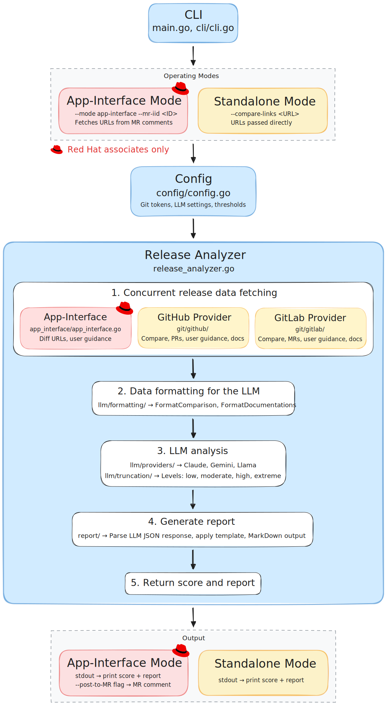

# Release Confidence Score

## Overview

**Stop guessing about releases. Get data-driven confidence scores and actionable risk assessments in seconds.**

Release Confidence Score analyzes code changes and generates objective confidence scores (0-100) with comprehensive risk reports.
Whether you're making manual release decisions or using automated gates in your continuous delivery pipeline, RCS provides consistent, AI-powered risk assessment to replace gut feelings with data.

### What You Get

- **Objective Confidence Scores**: Clear 0-100 ratings with consistent evaluation criteria across all releases.
- **Comprehensive Risk Analysis**: Detects critical risks including database migrations, authentication changes, API contracts, infrastructure modifications, and dependency updates.
- **Smart Context Integration**: Leverages repository documentation, QE test results, and user guidance comments for informed recommendations.
- **Actionable Reports**: Categorized action items (critical/important/follow-up) with specific release guidance and risk mitigation steps.

### Why Teams Choose RCS

- **Reduce Decision Stress**: Consistent, data-driven criteria replace subjective judgment calls for manual releases.
- **Enable Automated Gates**: Use confidence scores as quality gates in CI/CD pipelines for safe continuous delivery.
- **Save Time**: Automated analysis of diffs, changelogs, and documentation in one comprehensive report.
- **Prevent Production Issues**: Identify high-risk changes before they reach users.
- **Scale Your Expertise**: Apply seasoned release judgment consistently across all releases.

## Prerequisites

- API access to one of the supported AI providers (Claude, Gemini or Llama).
- GitHub and GitLab personal access tokens.

## Quick Start

RCS supports two operation modes:
- **App-Interface Mode**: Analyzes app-interface merge requests with automatic diff collection
- **Standalone Mode**: Analyzes GitHub/GitLab compare URLs directly

### Using Docker Compose (Recommended)

1. **Clone the repository**
   ```bash
   git clone git@github.com:RedHatInsights/release-confidence-score.git
   cd release-confidence-score
   ```

2. **Configure environment**
   ```bash
   cp .env.example .env
   # Edit .env with your credentials
   ```

3. **Build the image**
   ```bash
   docker compose build
   ```

4. **Run analysis**

   **App-Interface Mode:**
   ```bash
   docker compose run --rm rcs --mode app-interface --merge-request-iid 160191
   ```

   **Standalone Mode:**
   ```bash
   docker compose run --rm rcs --compare-links "https://github.com/org/repo/compare/v1.0...v1.1"
   ```

   **Post report to merge request:**
   ```bash
   docker compose run --rm rcs --mode app-interface --merge-request-iid 160191 --post-to-mr
   ```

### Using Go Directly

1. **Clone the repository**
   ```bash
   git clone git@github.com:RedHatInsights/release-confidence-score.git
   cd release-confidence-score
   ```

2. **Set environment variables**
   ```bash
   export RCS_GITHUB_TOKEN="your_github_token"
   export RCS_GITLAB_BASE_URL="https://gitlab.cee.redhat.com/"
   export RCS_GITLAB_TOKEN="your_gitlab_token"
   export RCS_MODEL_PROVIDER="claude" # or gemini, llama
   export RCS_CLAUDE_MODEL_API="your_claude_api_endpoint"
   export RCS_CLAUDE_MODEL_ID="claude-sonnet-4@20250514"
   export RCS_CLAUDE_USER_KEY="your_claude_api_key"
   ```

3. **Build the application**
   ```bash
   go build -o rcs
   ```

4. **Run analysis**

   **App-Interface Mode:**
   ```bash
   ./rcs --mode app-interface --merge-request-iid 160191
   ```

   **Standalone Mode:**
   ```bash
   ./rcs --compare-links "https://github.com/org/repo/compare/v1.0...v1.1,https://github.com/org/other/compare/v2.0...v2.1"
   ```

   **Using shorthand flags:**
   ```bash
   ./rcs -m app-interface -mr 160191
   ./rcs -c "https://github.com/org/repo/compare/v1.0...v1.1"
   ```

   **Get help:**
   ```bash
   ./rcs --help
   ```

## Configuration

### Required Environment Variables

**GitHub Integration:**
- `RCS_GITHUB_TOKEN`: GitHub personal access token.

**GitLab Configuration:**
- `RCS_GITLAB_BASE_URL`: GitLab instance URL.
- `RCS_GITLAB_TOKEN`: GitLab personal access token.

**Provider-Specific Configuration:**

For Claude (default):
- `RCS_CLAUDE_MODEL_API`: Claude API endpoint.
- `RCS_CLAUDE_MODEL_ID`: Model identifier (e.g., `claude-sonnet-4@20250514`).
- `RCS_CLAUDE_USER_KEY`: Authentication key.

For Gemini:
- `RCS_GEMINI_MODEL_API`: Gemini API endpoint.
- `RCS_GEMINI_MODEL_ID`: Model identifier (e.g., `gemini-2.5-pro`).
- `RCS_GEMINI_USER_KEY`: Authentication key.

For Llama:
- `RCS_LLAMA_MODEL_API`: Llama API endpoint.
- `RCS_LLAMA_MODEL_ID`: Model identifier (e.g., `RedHatAI/Llama-3.3-70B-Instruct-FP8-dynamic`).
- `RCS_LLAMA_USER_KEY`: Authentication key.

### Optional Environment Variables

**AI Provider Selection:**
- `RCS_MODEL_PROVIDER`: Choose `claude` (default), `gemini`, or `llama`.

**Model Configuration:**
- `RCS_MODEL_SKIP_SSL_VERIFY`: Skip SSL verification for AI provider (default: false).
- `RCS_MODEL_MAX_RESPONSE_TOKENS`: Maximum tokens in AI response (default: 2000).
- `RCS_MODEL_TIMEOUT_SECONDS`: Request timeout in seconds (default: 120).
- `RCS_SYSTEM_PROMPT_VERSION`: System prompt version to use (default: v1).

**GitLab Configuration:**
- `RCS_GITLAB_SKIP_SSL_VERIFY`: Skip SSL verification (default: false).

**Logging Configuration:**
- `RCS_LOG_FORMAT`: Log output format - `text` or `json` (default: text).
- `RCS_LOG_LEVEL`: Log level - `debug`, `info`, `warn`, or `error` (default: info).

**Score Thresholds:**
- `RCS_SCORE_THRESHOLD_AUTO_DEPLOY`: Minimum score for auto-deployment recommendation (default: 80).
- `RCS_SCORE_THRESHOLD_REVIEW_REQUIRED`: Minimum score before manual review required (default: 60).

See `.env.example` for a complete configuration template.

## How RCS Works

### App-Interface Mode
1. **App-Interface Data Collection**: Fetches merge request details from GitLab app-interface repository, including diff URLs and user guidance from merge request comments.
2. **Repository Data Collection**: Retrieves commits, documentation, user guidance, and QE testing labels from GitHub and GitLab repositories being released.
3. **Data Processing**: Analyzes and formats collected data, builds changelogs from commits, processes QE testing labels to assess test coverage, and prepares consolidated context for AI analysis.
4. **AI Analysis**: Sends consolidated data with specialized system prompt to the configured AI provider for risk assessment.
5. **Report Generation**: Produces a detailed report with confidence score, risk factors, release recommendations, changelogs, user guidance (with author authorization status), diff truncation details when applicable, and tips for improving future analysis with better documentation.
6. **Optional MR Posting**: If `--post-to-mr` flag is used, posts the report as a comment on the merge request.

### Standalone Mode
1. **Repository Data Collection**: Directly analyzes the provided GitHub/GitLab compare URLs, retrieving commits, documentation, user guidance, and QE testing labels.
2. **Data Processing**: Same as app-interface mode - analyzes data, builds changelogs, processes QE labels.
3. **AI Analysis**: Sends consolidated data with specialized system prompt to the configured AI provider for risk assessment.
4. **Report Generation**: Produces the same detailed report and prints to stdout.



[Diagram Source](https://excalidraw.com/#json=rx2mPOLX3f5C61e068VE4,WDdT3hHbWEDJ1xDv2EBN5Q)

## Features

### Smart Diff Handling

Automatically handles large diffs that exceed AI context windows using progressive truncation:
- **First attempt**: Analyzes full diff content without any truncation.
- **Progressive retry**: If context window is exceeded, automatically retries with increasing truncation levels (low → moderate → high → extreme).
- **Risk-based preservation**: Prioritizes critical files (database migrations, security code, API contracts, infrastructure) while truncating low-risk files (tests, documentation, generated files).
- **Small file protection**: Files below size thresholds are never truncated (100/75/50/20 lines for low/moderate/high/extreme levels).
- **Transparent reporting**: Reports truncation level and impact in the final analysis.

### Repository Documentation Integration

RCS automatically fetches `.release-confidence-docs.md` from repository roots to provide release context that improves AI analysis accuracy.
Links listed in the "Additional Documentation" section are also fetched and analyzed.
The AI uses this documentation to provide context-aware risk assessment tailored to your specific service.

### User Guidance from Comments

Developers can provide release-specific guidance in pull request/merge request comments to help the AI make better decisions.

**Format (all platforms):**
```
/rcs This release includes database migrations that require manual steps after deployment.
```

The `/rcs` prefix can appear anywhere in the comment, and everything after it is captured as guidance. Multiple lines are supported.

**Authorization**: Only guidance from the PR/MR author or approvers is marked as authorized and weighted more heavily in the analysis.

### QE Testing Labels

RCS recognizes QE testing labels on pull requests and merge requests:
- `rcs/qe-tested`: Changes have been verified by QE
- `rcs/needs-qe-testing`: Changes require QE verification

These labels are included in the analysis to help assess test coverage and release risk.
